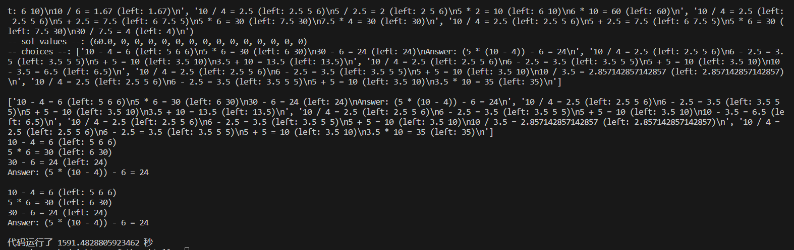

技术分析：大模型解决问题的应用——思维树方法

## 1. 研究主题

### 1.1 应用概述

本研究聚焦于不依赖模型微调，而是通过构建提示词的方法，来解决需要深度探索和策略性预测的任务。传统的standard prompting方法在此类问题上表现不佳，因此本文介绍了基于CoT（chain of thought）和CoT-SC（chain of thought self-consistency）的优化，提出了一种新的、基于树形结构的提示词方法——思维树。

### 1.2 应用领域

本方法适用于需要深度规划和搜索的场景，例如24点游戏、创意写作和纵横字谜等。这些任务不仅需要推理、数学和词汇技能，还要求系统性的规划和搜索。文章以24点游戏为例，进行深入分析。

## 2. 关键发现

### 2.1 解决的挑战

- standard prompting在复杂数学推理问题上的局限性。
- CoT的思维分解不够明确。
- CoT-SC虽然改进了CoT，增加了思考过程的多样性，但缺乏对各思维步骤的局部探索，并且其“最频繁”输出的启发式在输出空间广阔时不够有效。

[不同方法结构图](./pictures/teaser.png)

### 2.2 技术框架

#### 算法思想

1. 思维树（ToT）的核心在于模拟问题解决过程中的信息反馈循环，允许模型自我评估中间思考步骤，并通过自我指导的推理过程寻找解决方案。
2. 方法包括：
   - 树形结构引导问题解决。
   - 使用BFS或DFS等搜索算法探索思维树。
   - 结合语言模型的生成和评估能力，以适应不同任务需求。

#### 算法流程

1. **思维分解**：按问题性质，将其拆分为较小、连贯的思维步骤。
2. **思维生成**：针对每个步骤，构思可能的解决路径。
3. **状态评估**：运用语言模型评定各解决方案的有效性。
4. **搜索算法**：采用适当的算法，遍历思维路径，识别最优解。

- 思维生成：
  - Sample：基于CoT提示，利用语言模型进行思维抽样。
  - Propose：针对特定目标提出思维，如在24点游戏中，提议特定操作以达成目标。
- 状态评估：
  - Value：直接为状态赋值，快速评估。
  - Vote：通过比较多状态，基于模型输出进行投票，间接评估。
- 搜索算法：根据任务差异，如24点游戏使用BFS，创意写作采用DFS。

## 3. 实验安排

### 24点游戏

24点游戏是一种旨在检验数学推理能力的挑战，其核心目标是利用四个给定数字和基本算术运算（加、减、乘、除）计算出24。例如，对于数字“4、9、10、13”，一个可能的解是“(10 - 4) * (13 - 9) = 24”。

**任务设置：** 实验数据来自4nums.com，一个包含1,362个不同难度级别的24点游戏挑战的网站。专注于难度较高、排名在901至1,000之间的挑战。设定的评估标准是解题成功率，即所提出的方程式能正确利用所给数字并计算出24的情况。模型采用GPT-2。温度采用0.7

**基准测试：** 我们采用了一个标准的输入输出（IO）模型，以五个实例进行训练。对于更复杂的“思维链”（CoT）模型，我们在每个步骤中加入了三个中间方程来模拟思考过程。这些模型都经过100次的测试以评估它平均表现。此外，我们还引入了一个“自我修正”的过程，通过最多10轮的迭代来优化CoT模型的输出。

**ToT实施：** 我们采用“任务导向思维测试”（ToT）方法，将解题过程分解为三个步骤，并在每一步骤中都提出新的挑战。我们通过宽度优先搜索（BFS）策略，在每个节点都提供五个可能的解决方案，并提示模型基于概率评估选择最有可能的解决路径。

\begin{table}
\centering
\begin{tabular}{l|l l l}
\hline \hline
 & **24点游戏** & **创意写作** & **5x5纵横字谜** \\
\hline
**输入** & 4个数字 & 4个随机句子 & 10个提示 \\
**输出** & 达到24的方程 & 结合4句的段落 & 5x5字谜解答 \\
**思维过程** & 3个中间方程 & 简短写作计划 & 提示匹配填词 \\
**ToT步骤** & 3 & 1 & 5-10（可变） \\
\hline \hline
\end{tabular}
\caption{表1：不同任务的输入、输出和思维过程概览。}
\end{table}

**结果分析：** 传统的IO和CoT方法在解题成功率上表现不佳，仅分别达到7.3％和4.0％，而自我修正的CoT稍有提高，达到9.0％。相比之下，ToT方法即使在最基本的形式下（b=1）也达到了45％的成功率，扩展形式（b=5）更是达到了74％。通过进一步的对比分析，我们发现ToT方法在复杂度和效果之间取得了更好的平衡。

**错误分析：** 我们深入研究了模型在哪一步最容易出错，以便理解失败的根本原因。有趣的是，我们发现约60％的CoT模型在第一步就失败了，这表明了从左到右的解码策略存在根本性的缺陷。


## 4. 模拟流程

当需要数字组合“4 5 6 10”时，以下是模拟的具体过程：

**IO:** 对于IO提示，简单地提供5个24点游戏和5个相应的答案，然后让大模型输出结果。我们对IO和CoT提示进行100次抽样以得出平均性能。
```plaintext
standard_prompt = '''
使用数字和基本的算术运算(+ - * /)来得到24。
输入: 4 4 6 8
答案: (4 + 8) * (6 - 4) = 24
输入: 2 9 10 12
答案: 2 * 12 * (10 - 9) = 24
...
输入: {input}
'''
```

**CoT:** 对于CoT提示，我们增加了每个输入输出对中的3个中间方程。
```plaintext
cot_prompt = '''
使用数字和基本的算术运算(+ - * /)来得到24。每一步，你只能选择剩下的两个数字得到一个新的数字。
输入: 4 4 6 8
步骤:
4 + 8 = 12 (剩下: 4 6 12)
6 - 4 = 2 (剩下: 2 12)
2 * 12 = 24 (剩下: 24)
答案: (6 - 4) * (4 + 8) = 24
...
输入: {input}
'''
```

**CoT-SC:** 它使用前100个CoT样本中的大多数输出，并在IO样本的基础上进行了最多10次的迭代细化。请注意，它使用关于方程正确性的真实反馈信号。

**TOT-BFS:** CoT需要三个路径。ToT首先只需要生成多个结果节点。生成完毕后，我们需要找到最佳路径。此时有一个评估过程，评估过程按照'sure'、'likely'、'impossible'对其进行评价，分数的设定为{'impossible': 0.001, 'likely': 1, 'sure': 20}。
```plaintext
propose_prompt = '''
输入: 2 8 8 14
可能的下一步:
2 + 8 = 10 (剩下: 8 10 14)
...
2 * 8 = 16 (剩下: 8 14 16)
输入: {input}
可能的下一步:
'''

value_prompt = '''
评估给定的数字是否可以达到24 (sure/likely/impossible)
10 14
10 + 14 = 24
确定
...
5 7 8
(8 - 5) * 7 = 21
我现在无法得到24，但数字处于合理范围内
可能
'''

value_last_step_prompt = '''
使用数字和基本的算术运算(+ - * /)来得到24。给定输入和答案，如果答案是正确的，即它使用每个输入且不使用其他数字，并且得到24，请给出判断(sure/impossible)。
输入: 4 4 6 8
答案: (4 + 8) * (6 - 4) = 24
判断: 
确定
...
输入: {input}
答案: {answer}
判断:
'''
```

[代码核心模块](./pictures/代码核心模块.png)

## 5. 总结

### 1. 自我反思的重要性
   - **进化的解决方案评估**：LLMs在评估其预测的可行性方面变得至关重要，尤其是在解决需要深思熟虑的复杂问题时。
   - **自我反思机制**：引入的“自我反思”机制允许LMs对其输出进行内部评估，为调整和改进提供空间。
   - **通用性与特定性**：ToT方法展现了高度的适应性，能够处理在标准提示下GPT-4可能表现不佳的任务，这证明了它在多样化和复杂情境下的应用潜力。

### 局限性与未来探索
- **适用性范围**：ToT的实用性可能受限于那些GPT-4已表现出高效能力的任务，意味着它在某些领域可能并非必要的工具。
- **资源消耗**：虽然ToT需要更多资源来优化任务表现，但它的模块化构建提供了调整性能和成本的灵活性，这对于资源敏感的应用尤为重要。
- **未来复杂任务的出现**：随着LMs在现实世界的决策应用中不断扩展，我们预见到更多复杂任务的出现，这些任务将需要更精细化的处理和解决策略。

### 资源使用情况
根据不同方法，资源消耗如下：
- **IO方法**：需要 6960 个完成令牌，2185 个提示令牌，成本为 0.48315。
- **CoT-SC方法**：到目前为止的使用情况包括 7349 个完成令牌，4000 个提示令牌，成本为 0.56094。
- **ToT方法**：涉及 9161 个完成令牌，28451 个提示令牌，总成本为 1.40319。

